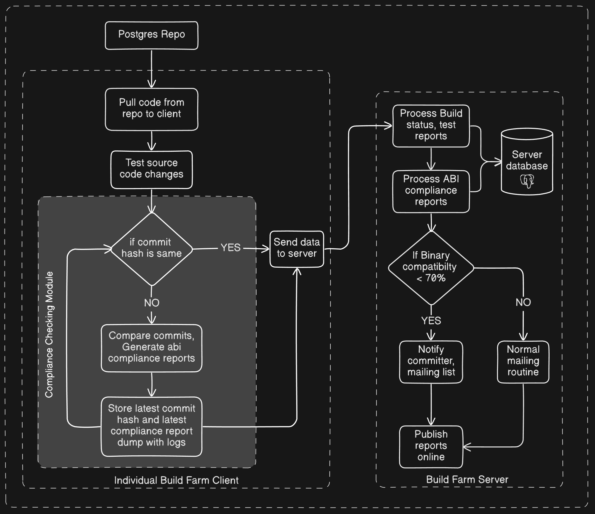

If you have not read the [part 1 of this blog](https://blog.mankiratsingh.com/posts/abi-compliance-reporting-part-1/), consider reading that to get some context where I will be starting this one from :D

# How PostgreSQL build farm will be used for this tool?
The Implementation for this project will be divided in **3 major parts**

## 1) Deciding the ABI Compliance checking tool
As per [this thread](https://www.postgresql.org/message-id/flat/CAH2-Wzk7tvgLXzOZ8a22aF-gmO5gHojWTYRvAk5ZgOvTrcEQeg%40mail.gmail.com), for ABI compliance checking, [abi-compliance-checker](https://lvc.github.io/abi-compliance-checker/) is a great choice which can also give its reports in HTML format, which makes it a very great fit for the project.<br>
But the `abi-compliance-checker` appears to be [deprecated](https://github.com/lvc/abi-compliance-checker/issues/127) and [unsupported](https://github.com/Homebrew/homebrew-core/pull/173741) upstream. So, I had to do some research into alternatives to that which can support multiple compilers and is actively maintained.

### My findings
There was not as much recent discussions on ABI compliance checking out there and most of them were like 4-5 yrs or like 10 yrs old.<br>
[This](https://github.com/bitcoin-core/secp256k1/pull/1380) repo is the most recent one which I found to be working with abi checking but at the end they are using `abi-compliance-checker` only. <br><br>
This made me question...how? as abi-compliance-checker is deprecated.
#### Back to ABI Compliance Checker (abicc)
So after reading some other references as well, we have two ways of using `abi-compliance-checker`:
1) If we directly provide the header files and libraries to `abi-compliance-checker` then it will give the warning just like mentioned in the homebrew discussion you sent.
    ```html
    WARNING: May not work properly with GCC 4.8.[0-2], 6.* and higher due to bug
    #78040 in GCC. Please try other GCC versions with the help of --gcc-path=PATH
    option or create ABI dumps by ABI Dumper tool instead to avoid using GCC. Test
    selected GCC version first by -test option.
    ```
2) But, if we use the [ABI Dumper](https://github.com/lvc/abi-dumper) tool and then use abi-compliance-checker over the dumps generated, it will not require to use GCC by its own and hence results in no warnings, works like a charm, but it requires to force DWARF4 and debug symbols using `-Og -g -gdwarf-4` flags while compiling.

#### Redhat supported libabigail suite
It is a suite of tools named `libabigail`.
For our use case, `abidw` and `abidiff` tools are good enough and interestingly its the **only actively maintained tool** for abi complianre checking out there.<br>
To make an reports using this, first use [abidw](https://sourceware.org/libabigail/manual/abidw.html) to create XMLs containing the ABI data and then compare the XMLs using [abidiff](https://sourceware.org/libabigail/manual/abidiff.html).

#### Other Tools
There are other tools out there for abi complaince checking like `icheck`, `abicheck` but these are not maintained any more Android have VNDK, NodeJS have n-api for the same purpose and most of the tools which mention abi compatibility, like [apertis](https://www.apertis.org/guides/app_devel/api-abi_evolution_guideline/), [fedora](https://fedoraproject.org/wiki/How_to_check_for_ABI_changes_in_a_package), linux[?](https://lpc.events/event/16/contributions/1176/attachments/967/2166/libabigail-lpc.pdf), [glibc](https://sourceware.org/glibc/wiki/Testing/ABI_checker) don't have any predefined workflows for ABI compliance checking and suggest `libabigail` and `abi-compliance-checker` only.

### Output comparisons
I compared Postgres version 17.2 and 17.3 on my machine using both abidiff[[here](https://drive.google.com/file/d/1EFW2BHsRglAuNTjF6DpizRiX8iSNBsaN/view)] and abicc[[here](https://abicc-17-2-17-3-postgres.mankiratsingh.com/)], both of them are almost the same (content-wise), just the way of presenting info is different.
#### Comparing libabigail and abi-compliance-checker -
* **Output Format:**
  * **Abidiff:** Produces output only in plain text format; lacks XML, HTML, or any formatting support.
  * **ABI Compliance Checker (abicc):** Generates formatted outputs, including HTML reports.​
* **Compatibility:**
  * **Abidiff:** Supports ELF binaries only; does not support XCode for macOS or MS Visual C++ (dumpbin, undname). Uncertain support for MinGW.
  * **ABI Compliance Checker:** Does not support DWARF5 and requires debug symbols in binaries to function.​
* **Supported Compilers:​**<br>
    Both tools support GCC and Clang compilers.​
* **Maintenance Status:**<br>
    ABI Compliance Checker is considered unmaintained, while Libabigail (including Abidiff) is actively maintained and updated.
### My Understanding
If we need abi reports without debug symbols and with dwarf5 support only, then we should move with libabigail only else abi-compliance-checker is not that bad as it also supports MS Visual C++ and XCode binaries as well.<br>
Furthermore, I tried parsing the `abidiff` output in HTML using a Perl script, I would not say it's totally accurate, but it can detect common regular expressions from the abidiff outputs and generate reports from it.
There could also be the possibility of using multiple tools depending on the platform in the future. For example, libabigail should work well with GCC, Clang, and MinGW, while abi-compliance-checker would be suitable for the Visual Studio C++ compiler.

### Final choice
Sticking to GCC, Clang implementation should be the main goal for the project as of now as there are very few build farm animals using compilers other than these, according to [this list](https://buildfarm.postgresql.org/cgi-bin/show_members.pl).<br>
So, **I will be using libabigail** and try to set up the first implementation of the project in such a way that new tools can be adapted to it in the future.

## 2) Build Farm Client - Generating ABI Compliance Reports
As briefed in Part 1 of this blog as well the [Build Farm client](https://github.com/PGBuildFarm/client-code) is responsible for running the tests from the PostgreSQL official repo and sending the results to the build farm server.<br>
Using this to my advantage, I will develop a **new extension** will be added along with some **new configuration options** for abi compliance checking(such as Postgres build options and changing the default compliance checking path etc.) to the build farm client. As existing client operates on cron jobs only, so the last commit hash will be stored with the logs and subsequently compare all the latter commits using `abidiff`.

## 3) Server Refactoring
The [build farm server](https://github.com/PGBuildFarm/server-code) is responsible for receiving the processing results from the clients, processing and viewing them on the web, and sending email notifications to the people on the mailing list.<br>
  1) **Add Compliance Reports Handling**<br>
    The compliance reports received from clients will be processed on the server to show the abi compliance status of all commits on a web page and provide an interface similar to the [abi-tracker](https://abi-laboratory.pro/?view=timeline&l=glib) for easier visualisation.

  2) **Mailing Logic Update**<br>
    Currently, the server’s mailing works on mailing lists like these, which are predefined in the server configuration as arrays:<br> 
    `$all_stat`, `$fail_stat`, `$change_stat`, `$green_stat`<br>
    A binary compatibility percentage, similar to abi-tracker will be defined to send notifications of abi incompatibility over their commit via email to the committers, which also reduces false positives. Along with that, the current mailing list will also prevail in case someone wants to subscribe to the ABI related events.

  3) **Database Update**<br>
    The existing build farm database schema will be updated to store ABI compliance reports, ensuring that all relevant data is captured and can be referenced for future analysis and reporting.

## Outline of Approach

**Note -** `abidw` emits an XML representation of its ABI to standard output. The emitted representation format, is named ABIXML, which contains the raw form of ABI data of an ELF binary.

# What's next?
I will roll out new blogs as I progress through the project(possibly a week later).<br>
I would love to hear any suggestions you might have. Reach me out on email(mankiratsingh1315@gmail.com)<br>
Thanks for reading!