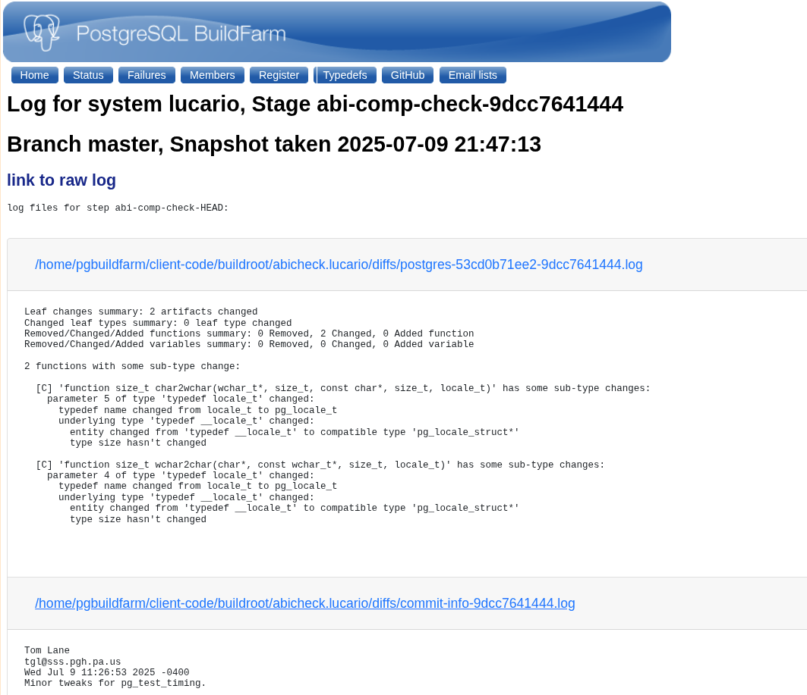

In my last post, "[June, BuildFarm and ABIs](https://blog.mankiratsingh.com/posts/june-postgres-and-abicc/)" I mentioned my next step would be setting up the buildfarm server. However, plans have shifted slightly. This past week, I focused on minor bug fixes and, more importantly, figuring out how to send ABI compliance reports to the buildfarm server.

So, let's dive into the details of what I've been up to!

## Client changes
1. Using abbreviated commit hashes for everything.
2. Reducing code duplication.
3. Fixing the `run_branches.pl` script.
4. Sending results to the buildfarm server.

The fourth task, sending results to the buildfarm, proved to be the most challenging. Initially, I thought it would be as simple as using the `run_web_txn` function from the web module. I tried get help using AI for this but it ended up generating some random AI slop which just don't work as big tech tech don't have much Perl codebases in their datasets lol.

However, the buildfarm client performs a single web transaction at the very end of a run. It creates a `.tgz` archive containing all logs and results from the run and sends this single file to the buildfarm server for the specific branch being tested.

After examining how other modules handled this, I determined the correct approach. I needed to create a new `PGBuild::Log` object using its `new` routine. Then, I could use the `add_log` method to append the `abidiff` logs to this object. Finally, by changing the directory to `$buildroot/$branch` and calling `writelog`, the `abidiff` logs for the current run are saved, ensuring they are included in the final `.tgz` archive.

This is a short snippet illustrating the process, which runs if a diff is found between commits.
```perl
my $log = $self->{logs};
my @saveout;
foreach my $diff_log (@diff_logs)
{
    $log->add_log($diff_log);
}

$log->add_log($commit_info_file);
push(@saveout, $log->log_string);
my $orig_dir = Cwd::cwd();
chdir $self->{buildroot} . "/" . $self->{pgbranch};
writelog("abi-comp-check-$new_commit_hash", \@saveout);
chdir $orig_dir;
```
You might have noticed the `$commit_info_file` variable and the `@diff_logs` and `@saveout` arrays in the snippet above. Here's how it works: when an ABI difference is found between an old and a new commit, the diff is saved to a log file. The path to this file is then added to `@diff_logs`. This process is repeated for all binaries specified in the configuration file (or the defaults: `postgres`, `ecpg`, `libpq.so`). Next, we retrieve the commit information for the committer who needs to be notified using `git show $new_commit_hash --quiet --pretty=format:"%cn%n%ce%n%cd%n%s%n%n%b"`. This command produces an output file with the following format:
```
<committer-name>
<committer-email>
<commit-date>
<commit-message>
```
All these diff files and the commit info file are added to the log object using `add_log`. Then, a log string is generated using `log_string` and pushed into `@saveout`. The `log_string` method formats all the log file contents into a single string, separated by markers that the server can parse. I found this logging method quite interesting. The output looks something like this:
```
log files for step abi-comp-check-HEAD:
==~_~===-=-===~_~== <diff-file1-path> ==~_~===-=-===~_~==
logs..
..
..
==~_~===-=-===~_~== <commit-info-file-path> ==~_~===-=-===~_~==
logs..
..
..

```
After that, we just change the directory to `$buildroot/$branch` and call `writelog` to save this file. This ensures it will be included in the final `.tgz` archive, and voila! The logs are received by the buildfarm server.


If you might notice the above image from my local server, I actually got an ABI breakage in postgres binary while testing, though it seems to be a false positive and anyways ABI changes are allowed in the master branch that I tested on.


## What next?
Sometimes, a commit that fails to build can halt the entire script, even though subsequent commits might contain the necessary fixes. I will be working on handling these cases by ignoring problematic commits and using the commit immediately preceding the failed one as the baseline for comparison against the next successful commit.
I would like to know any thoughts or suggestions you might have over postgres mailing lists or at mankiratsingh1315@gmail.com.

### Thanks for Reading!
